---
# You can also start simply with 'default'
theme: seriph
# random image from a curated Unsplash collection by Anthony
# like them? see https://unsplash.com/collections/94734566/slidev
background: https://cover.sli.dev

# some information about your slides (markdown enabled)
title: 태어난 김에 MLOps
info: |
  ## 핸즈온으로 배우는 MLOps
  Kaggle부터 MLflow, Feast까지 실무 중심의 MLOps 여행

  Learn more at [Sli.dev](https://sli.dev)
# apply unocss classes to the current slide
class: text-center
# https://sli.dev/features/drawing
drawings:
  persist: false
# slide transition: https://sli.dev/guide/animations.html#slide-transitions
transition: false
footer: '{{page}} / {{total}}'
# enable MDC Syntax: https://sli.dev/features/mdc
mdc: true
# open graph
# seoMeta:
#  ogImage: https://cover.sli.dev
fonts:
  # like font-family in css, you can use `,` to separate multiple fonts for fallback
  sans: 'Helvetica Neue,Robot'
  # mark 'Helvetica Neue' as local font
  local: Helvetica Neue
layout: cover
---

# 태맬옵스: 태어난 김에 MLOps

**일단 <font color="blue">부딪히고</font> 보자**

<div class="pt-12">
  Kaggle → MLflow → Feast → ?
</div>

<div class="pt-12">
  asisjinwookim | 2025
</div>

---
layout: default
---

# 본 세션은 핸즈온 세션입니다

<div class="text-center">
  <div class="text-6xl mb-4">💻</div>
  <div class="text-2xl font-bold text-blue-600">노트북을 준비해주세요!</div>
</div>

* 실습 환경: Python, Jupyter Notebook
* 필요 도구: Git, Conda
* 예제 코드: GitHub 저장소 제공

---
layout: default
---

# 태어난 김에

<div class="grid grid-cols-2 gap-8">
<div>


* '[태어난 김에 세계일주](https://namu.wiki/w/%ED%83%9C%EC%96%B4%EB%82%9C%20%EA%B9%80%EC%97%90%20%EC%84%B8%EA%B3%84%EC%9D%BC%EC%A3%BC)'라는 프로그램
* 여행지 하나 골라서 무작정 떠나는 프로그램

</div>
<div class="text-left">

## <font color="blue">MLOps?</font>

* 잘 모르지만 <font color="red">일단 시작</font>

</div>
</div>

---
layout: default
---

# MLOps 파이프라인

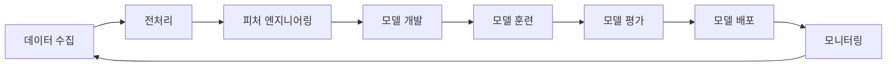

---
layout: default
---

# 직접 문제를 풀어보자

<div class="text-center mt-8">
  <div class="text-6xl text-red-600 font-bold">Kaggle!</div>
</div>

---
layout: default
---

# 환경 셋업부터 - conda

<div class="grid grid-cols-2 gap-8">
<div>

## Anaconda 설치
[다운로드 링크](https://www.anaconda.com/download/success)

## 기본 명령어
```sh
$ conda --version
conda 23.x.x
```

</div>
<div>

## 환경 관리
```sh
# environment.yml로부터 환경 생성
conda env create -f environment.yml

# 환경 업데이트
conda env update -f environment.yml

# 환경 활성화
conda activate {env_name}

# 환경 목록 확인
conda env list
```

</div>
</div>

---
layout: default
---

# Titanic 생존 예측 - 1

<div class="grid grid-cols-2 gap-8">
<div>

## 왜 Titanic인가?
* **Kaggle의 대표적인 입문 문제**
* 데이터 과학의 모든 단계를 경험할 수 있음

</div>
<div>

## 학습 포인트
* **데이터 정제** 및 전처리
* **Feature Engineering** (특성 엔지니어링)
* **머신러닝 기법** 적용
* **모델 평가** 및 최적화

</div>
</div>

---
layout: default
---

# Titanic 생존 예측 - 2

<div class="grid grid-cols-2 gap-8">
<div>

## 문제 정의
* **배경:** 1912년 침몰한 타이타닉호
* **목표:** 승객의 생존 여부 예측
* **타입:** 이진 분류 문제 (0: 사망, 1: 생존)

## 데이터셋
* `train.csv`: 훈련 데이터 (Survived 컬럼 포함)
* `test.csv`: 테스트 데이터 (Survived 컬럼 없음)

</div>
<div>

## Kaggle 링크
[🏆 Titanic Competition](https://www.kaggle.com/competitions/titanic)

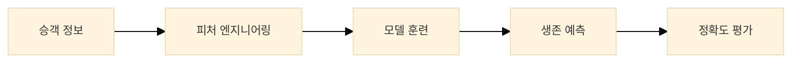

</div>
</div>

---
layout: default
---

# 일단 따라하기 - Titanic with Jupyter Notebook

<div class="text-center mb-6">
  <div class="text-4xl mb-4">🚀</div>
  <div class="text-xl font-bold text-green-600">핸즈온 시작!</div>
  <div class="mt-4 text-sm text-gray-600">
  💡 '개선된 모델' 섹션은 참고용으로 읽어보세요
  </div>
</div>

### 예제 저장소
[📁 20250709-titanic](https://github.com/studyteams/20250709-titanic/blob/main/README.md)

### 실습 범위
* **1단계:** 개발 환경 설정
* **2단계:** 데이터 탐색 및 전처리
* **3단계:** 피처 엔지니어링
* **4단계:** 모델 훈련 및 평가
* **5단계:** 최종 예측 및 제출


---
layout: default
---

# 데이터 과학 워크플로우 - 1

## 기본 워크플로우
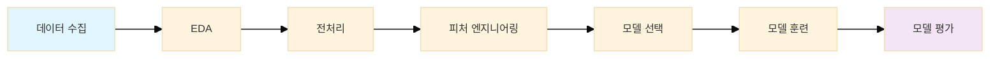

## 반복 개선 과정

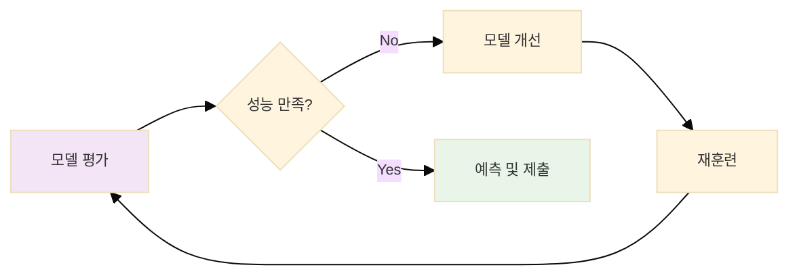

---
layout: default
---

# 데이터 탐색 (EDA) - 1

<div class="grid grid-cols-2 gap-8">
<div>

## 데이터 미리보기
```python
train_df.head()
```

## 주요 컬럼 설명
* **PassengerId:** 승객 고유 ID
* **Survived:** 생존 여부 (0=사망, 1=생존) - **🎯 타겟 변수**
* **Pclass:** 티켓 등급 (1=1등석, 2=2등석, 3=3등석)
* **Name:** 승객 이름
* **Sex:** 성별

</div>
<div>

## 추가 컬럼
* **Age:** 나이
* **SibSp:** 함께 탑승한 형제/배우자 수
* **Parch:** 함께 탑승한 부모/자녀 수
* **Ticket:** 티켓 번호
* **Fare:** 요금
* **Cabin:** 객실 번호
* **Embarked:** 승선 항구

</div>
</div>

---
layout: default
---

# 데이터 탐색 (EDA) - 2

<div class="grid grid-cols-2 gap-8">
<div>

## 데이터 정보 확인
```python
train_df.info()
test_df.info()
```

## 결측치 현황
* **훈련 데이터:**
  * Age: 177개 (19.9%)
  * Cabin: 687개 (77.1%)
  * Embarked: 2개 (0.2%)

* **테스트 데이터:**
  * Age: 86개 (20.6%)
  * Fare: 1개 (0.2%)
  * Cabin: 327개 (78.2%)

</div>
<div>

## 기술 통계량
```python
train_df.describe()
```

</div>
</div>

---
layout: default
---

# 데이터 탐색 (EDA) - 3

<div class="grid grid-cols-2 gap-8">
<div>

## 생존율 분석
* 전체 생존율: 약 38%
* 여성 생존율: 약 74%
* 남성 생존율: 약 19%

## 티켓 등급별 생존율
* 1등석: 약 63%
* 2등석: 약 47%
* 3등석: 약 25%

</div>
</div>

---
layout: default
---

# Kaggle에 제출!

<div class="text-center">
  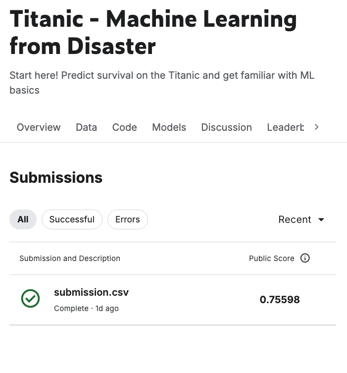

  <div class="mt-4 text-xl">
    <span class="text-green-600 font-bold">점수가 나옵니다</span>
  </div>

  <div class="mt-2 text-sm text-gray-600">
    🏆 Leaderboard에서 순위 확인 가능
  </div>
</div>

---
layout: default
---

# 실험 관리의 필요성

<div class="grid grid-cols-2 gap-8">
<div>

## 문제 상황
* **여러 실험**을 진행하면서 결과를 잊어버림
* **파라미터 변경**했는데 어떤 값이었는지 기억 안남
* **코드 버전**이 바뀌었는데 어떤 버전이 최고 성능이었는지 모름
* **팀원과** 실험 결과를 공유하기 어려움

</div>
<div>

## 해결책
* **MLflow**를 사용한 실험 추적
* **모델 버전 관리**
* **하이퍼파라미터 로깅**
* **시각화 및 비교**

</div>
</div>

---
layout: default
---

# MLflow란?

<div>

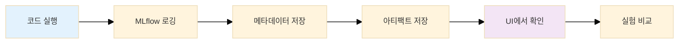

</div>
<div class="grid grid-cols-2 gap-8">
<div>

* **머신러닝 실험 관리** 플랫폼
* **Databricks**에서 개발한 오픈소스
* **실험 추적, 모델 관리, 모델 배포** 지원

## 주요 기능
* **Experiment Tracking:** 실험 결과 추적
* **Model Registry:** 모델 버전 관리
* **Model Serving:** 모델 배포 및 서빙

</div>
</div>

---
layout: default
---

# 일단 따라하기2 - Titanic with MLFlow

<div class="text-center mb-6">
  <div class="text-4xl mb-4">🔬</div>
  <div class="text-xl font-bold text-green-600">핸즈 온</div>
</div>

## 예제 저장소
[📁 20250709-titanic-mlflow](https://github.com/studyteams/20250709-titanic-mlflow/blob/main/README.md)

## 실습 범위
* **1단계:** 환경 설정
* **2단계:** MLflow 실험 설정
* **3단계:** 모델 실험
* **4단계:** MLflow UI에서 결과 확인

---
layout: two-cols
---

# MLflow UI - 실험 목록

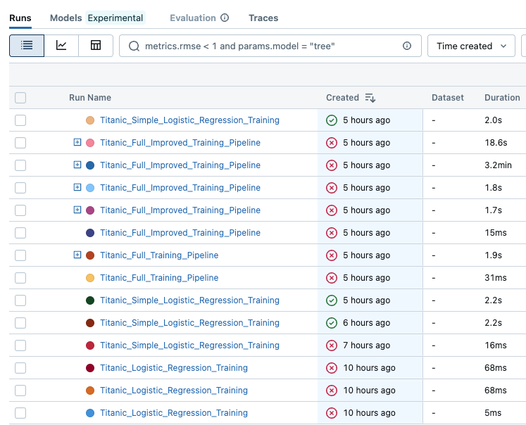

::right::

# MLflow UI - 실험 상세

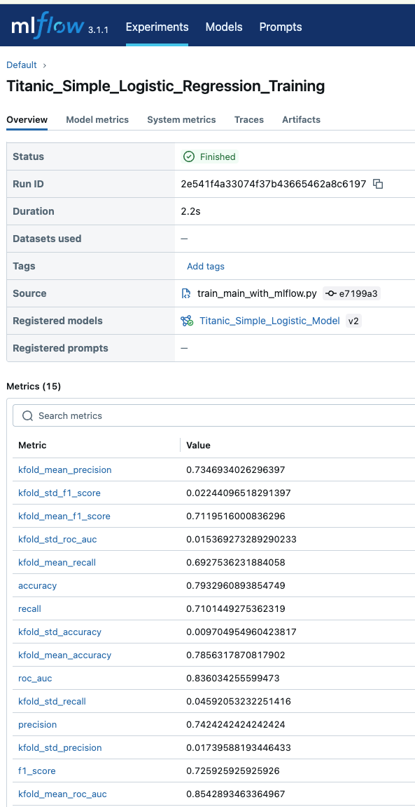

---
layout: default
---

# MLFlow on Localhost

## 서버 실행
```sh
conda activate titanic_mlflow
mlflow ui --port 5050
```

## 접속 링크
[🔗 MLFlow on Localhost](http://localhost:5050)

## 주요 기능
* **실험 목록** 및 비교
* **모델 아티팩트** 다운로드
* **파라미터** 및 메트릭 시각화
* **실험 태그** 및 노트 관리

---
layout: default
---

# 실험 관리 플로우 - 1

## 실험 시작 과정


<div style="margin-bottom: 50px;"></div>

## 실험 완료 과정
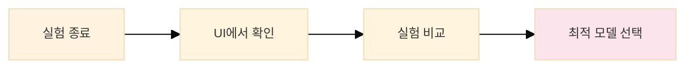

---
layout: default
---

# Titanic with Feast

<div class="grid grid-cols-2 gap-8">
<div>

## Feast란?
* **머신러닝 모델을 위한 Feature Store** 플랫폼
* **피처 데이터의 저장, 관리, 서빙**을 위한 중앙화된 시스템

## 주요 장점
* **피처 재사용성** 향상
* **학습/추론 일관성** 보장
* **실시간 서빙** 지원
* **피처 버전 관리**

</div>
<div>

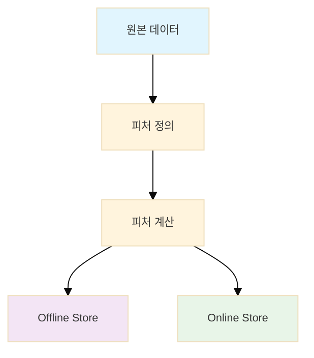

</div>
</div>

---
layout: default
---

# Feature Store가 필요한 이유

<div class="grid grid-cols-2 gap-8">
<div>

## 피처 엔지니어링의 복잡성

* **중복 작업:** 동일한 피처를 여러 모델에서 재계산
* **일관성 문제:** 모델마다 피처 계산 로직이 다름
* **버전 관리:** 피처 정의의 변경 이력 추적 어려움
* **재현성 부족:** 동일한 피처를 다시 만들기 어려움

</div>
<div>

## 데이터 파이프라인 관리

* **표준화:** 피처 저장소와 접근 방법 통일
* **메타데이터:** 스키마, 통계, 품질 정보 관리
* **이력 추적:** 피처 사용 및 변경 이력
* **품질 관리:** 피처 데이터의 유효성 검증

</div>
<div>

## 👥 팀 협업

* **피처 공유:** 데이터 과학자 간 피처 재사용
* **중앙 관리:** 피처 정의의 통합 관리
* **문서화:** 피처의 의미와 사용법 공유

</div>
</div>

---
layout: default
---

# 일단 따라하기3 - Titanic with Feast

<div class="text-center mb-6">
  <div class="text-4xl mb-4">🏪</div>
  <div class="text-xl font-bold text-green-600">Feature Store 핸즈온!</div>
</div>

## 예제 저장소
[📁 20250709-titanic-feast](https://github.com/studyteams/20250709-titanic-feast/blob/main/README.md)

## 실습 범위
* **1단계:** 환경 설정
* **2단계:** 피처 정의 및 저장소 설정
* **3단계:** 피처 데이터 구체화
* **4단계:** 실시간 피처 서빙
* **5단계:** Feast UI에서 피처 확인

---
layout: default
---

# Feast 핵심 개념 - 1

<div class="grid grid-cols-2 gap-8">
<div>

## 🏪 Feature Store
* 피처 데이터를 저장하는 **중앙화된 저장소**
* **Offline Store** (배치 학습/데이터셋/백필)
* **Online Store** (실시간 추론)

## 👁️ Feature View
* 특정 모델이나 사용 사례에 필요한 **피처들의 논리적 그룹**
* 피처 정의와 데이터 소스 연결

## 👤 Entity
* 피처와 연결되는 **비즈니스 객체**
* 예: PassengerId, UserId, ProductId

</div>
<div>

## 🔧 Feature Service
* **실시간 추론**을 위한 피처 서비스
* 여러 Feature View를 조합
* API 형태로 피처 제공

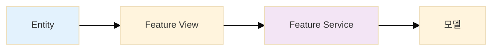

</div>
</div>

---
layout: default
---

# Feast 핵심 개념 - 2

<div class="grid grid-cols-2 gap-8">
<div>

## 📦 Offline Store
* **배치 학습/데이터셋/백필**을 위한 피처 저장소
* 예: Parquet, BigQuery, Snowflake
* **대용량 데이터** 처리에 최적화

## ⚡ Online Store
* **실시간 추론**을 위한 피처 저장소
* 예: Redis, DynamoDB, Cassandra
* **낮은 지연시간** 보장

## 📋 Feature Registry
* 피처 정의와 **메타데이터**를 저장하는 중앙 저장소
* 피처 스키마, 통계, 품질 정보

</div>
<div>

## 🔄 Feature Pipeline
* 피처 데이터를 **계산하고 저장**하는 파이프라인
* 배치 및 스트리밍 처리 지원
* **데이터 품질** 검증 포함

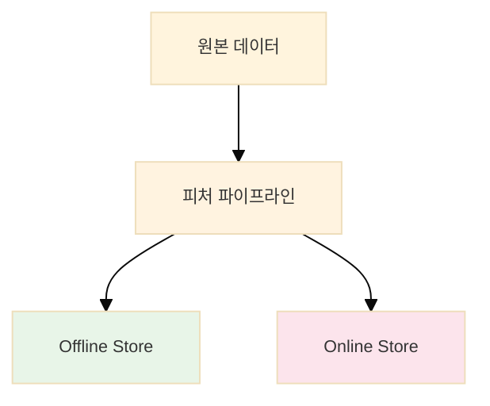

</div>
</div>

---
layout: default
---

# Titanic 데이터를 Feast로 관리하기

<div class="grid grid-cols-2 gap-8">
<div>

## 🆔 Entity
```python
passenger_id = Entity(
    name="passenger_id",
    description="승객 고유 식별자",
    value_type=ValueType.INT64
)
```

## 🎯 Features
* `pclass` (티켓 등급)
* `sex` (성별)
* `age` (나이)
* `sibsp` (형제/배우자 수)
* `parch` (부모/자녀 수)
* `fare` (요금)
* `embarked` (승선 항구)

</div>
<div>

## 📊 Feature View 예시
```python
passenger_features = FeatureView(
    name="passenger_features",
    entities=["passenger_id"],
    ttl=timedelta(days=365),
    features=[
        Feature(name="pclass", dtype=ValueType.INT64),
        Feature(name="sex", dtype=ValueType.STRING),
        Feature(name="age", dtype=ValueType.FLOAT32),
        # ... 기타 피처들
    ],
    online=True,
    source=passenger_source
)
```

</div>
</div>

---
layout: default
---

# Feast 명령어들

<div class="grid grid-cols-2 gap-8">
<div>

## 🚀 초기화 및 설정
```sh
# Feast 프로젝트 초기화
feast init titanic_feast

# 피처 저장소 적용
feast apply

# 피처 저장소 정보 확인
feast describe
```

## 📊 데이터 관리
```sh
# 피처 데이터 구체화 (Offline Store)
feast materialize

# 특정 기간 데이터 구체화
feast materialize 2023-01-01T00:00:00 2023-12-31T23:59:59
```

</div>
<div>

## 🌐 UI 및 모니터링
```sh
# Feast UI 실행
feast ui

# 피처 저장소 상태 확인
feast get-online-features

# 피처 서비스 테스트
feast get-online-features \
    --feature-service survival_prediction_service \
    --entity passenger_id:1
```

</div>
</div>

---
layout: default
---

# Feast UI on Localhost

## 서버 실행
```sh
conda activate titanic_feast
feast ui --port 5051
```

<div style="margin-bottom: 15px;"></div>

## 접속 링크
[🔗 Feast UI on Localhost](http://localhost:5051)

## 주요 기능
* **피처 정의** 및 스키마 확인
* **데이터 소스** 및 피처 뷰 관리
* **피처 데이터** 품질 및 통계 정보
* **피처 사용** 이력 추적

---
layout: two-cols
---

# 웹 애플리케이션

### DVC 웹앱
[🔗 DVC App](https://github.com/studyteams/20250709-dvc-app/blob/main/README.md)

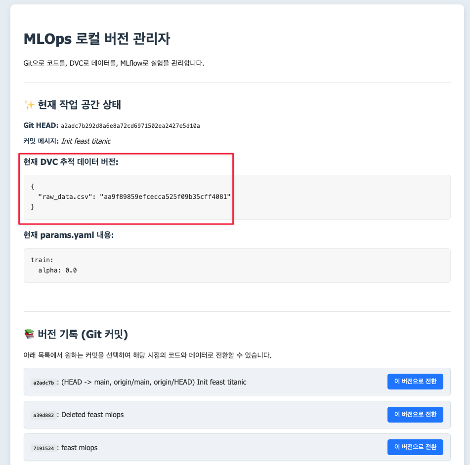

::right::

### 원 앱 솔루션
[🔗 MLOps App](https://github.com/studyteams/mlops-app/blob/main/README.md)

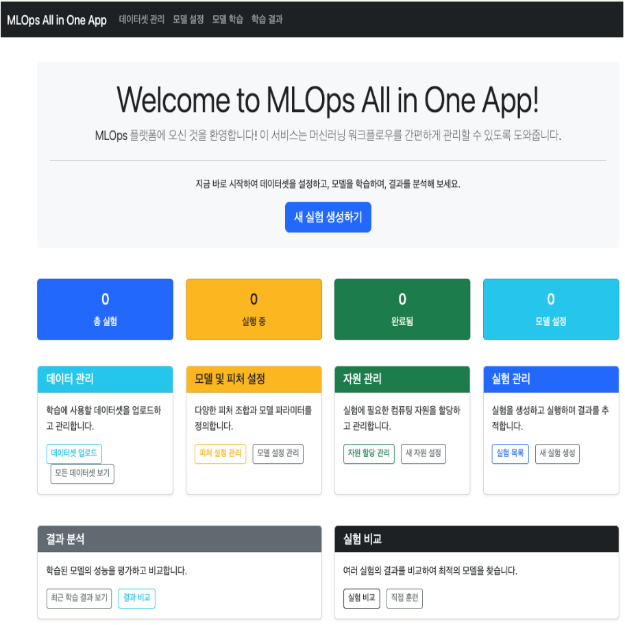

---
layout: default
---

# 그래서, 무엇이 필요한가?

<div class="grid grid-cols-2 gap-8">
<div>

## 🚨 **기존 ML 개발의 문제점**

* **데이터셋 관리**: 버전 관리 없이 파일로만 관리
* **피처 엔지니어링**: 모델마다 중복 계산, 일관성 부족
* **모델 버저닝**: 어떤 모델이 최고 성능인지 추적 어려움
* **자원 할당**: GPU/CPU 사용량 관리 부재
* **실험 추적**: 파라미터 변경 이력 관리 안됨

</div>
<div>

## ✅ **MLOps로 해결하는 방법**

* **피처 스토어**: 중앙화된 피처 관리
* **ETL 파이프라인**: 자동화된 데이터 처리
* **ML 버저닝**: 모델 아티팩트 버전 관리
* **관리용 애플리케이션**: 실험 추적 및 모니터링 UI
* **DevOps**: CI/CD, 자동화, 확장성

</div>
</div>

<div class="mt-8 text-center">
  <div class="text-lg font-bold text-blue-600">
    MLOps = ML + DevOps = <span class="text-red-600">자동화</span> + <span class="text-green-600">확장성</span> + <span class="text-purple-600">재현성</span>
  </div>
</div>

---
layout: default
---

# 트러블슈팅

* 첫 셋업 때 라이브러리 버전 간 호환성 맞추기
  * 실습에서는 conda로 떼웠지만 상용에서는 특히 주의
* Feast가 버전 별로 인터페이스가 꽤 달랐음
* Feast를 쓸거면 로컬에서도 csv 말고 parquet 포맷으로

---
layout: default
---

# 비고

* 피처 엔지니어링은 주요한 성능 향상의 기술
* 서버 엔지니어링 기본기 + DevOps = 시너지
* 머신러닝 기본기 + MLOps = 시너지
* 기반 기술을 깊이 이해하되, 쉽게 설명하기 위해 고민하자!
* 데이터 포매팅 디버깅은 LLM이 최고, 사람은 거의 못 따라갈 듯..
* Cursor 만세! Gemini 만세!

---
layout: default
---

# 자매품

* [(2025) Airflow Meetup (June)](https://asisjinwookim.notion.site/2025-Airflow-Meetup-June-21917076a7a680bc9f45faad1259c97c): 실무자들의 사례들!
* [(2025) 책 <두 얼굴의 신기술: AI 딜레마>](https://asisjinwookim.notion.site/2025-AI-22017076a7a680df8e43c5ed92bf8303): AI의 강점과 한계
* [(2025) 탐지 체계](https://asisjinwookim.notion.site/2025-1b517076a7a680d0b044dcbbfed49b8d): SRE 관점의 데이터 판단

---
layout: default
---

# 질문과 답변

<div class="text-center mb-8">
  <div class="text-4xl mb-4">❓</div>
  <div class="text-xl">궁금한 점이 있으시면 함께 논의해 보아요!</div>
</div>

<div class="text-center mt-8">
  <div class="text-2xl font-bold text-green-600">감사합니다! 🙏</div>
</div>
